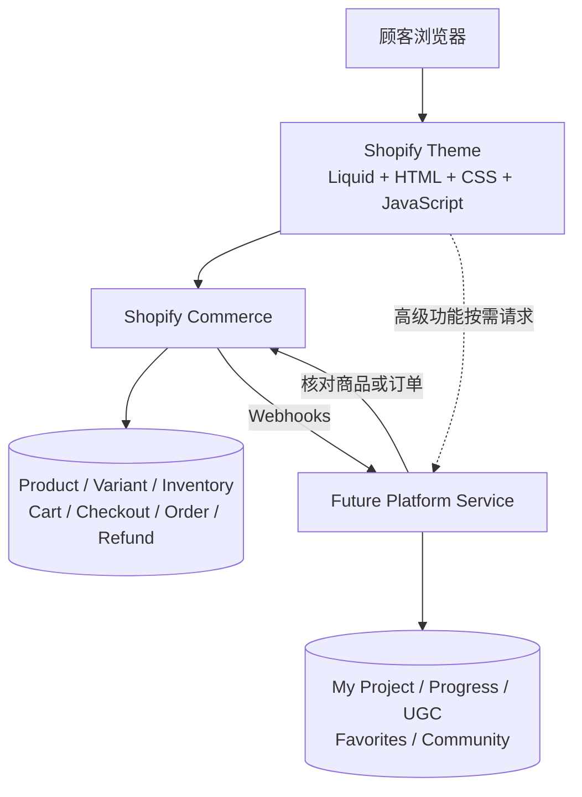

# Architecture

> Status: current direction
> Last updated: 2026-09-04

## Decision summary

当前采用 **Hybrid Shopify Storefront**：Shopify Theme 承担商店和交易主路径，未来的自有 Platform Service 承担个性化、内容与社区状态。不在 MVP 阶段全量迁移 Headless，但避免把平台业务逻辑写死在 Liquid 或浏览器脚本中。

## Current topology

Shopify 使用 Liquid 直接生成首屏商品内容。当某个页面需要 My Project 或 UGC 等高级功能时，Theme 中的 JavaScript 再通过自有 API 或 Shopify App Proxy 获取数据并渲染局部模块。

## Responsibility boundaries

| Capability | Source of truth | Notes |
| --- | --- | --- |
| Product, Variant, price | Shopify | 不在自有数据库中复制真值 |
| Inventory | Shopify | 单品和 Kit Component 引用同一 Variant 库存；Kit 可售量由组件库存共同约束 |
| Cart, Checkout | Shopify | 支付与结账路径不自建 |
| Order, refund | Shopify | 自有系统可保存 Shopify ID 和派生状态 |
| Project 公开内容 | Shopify Metaobjects / Metafields initially | 名称、难度、时间、教程和关联商品 |
| My Project, progress | Platform Service | 个性化状态 |
| UGC, favorites, likes | Platform Service | 包含权限、审核和媒体存储 |
| Community, creator, payout | Platform Service | 只在经过人工验证需求后建设 |

Platform Service 中的记录使用 `shopify_customer_id`、`shopify_product_id`、`shopify_variant_id` 和 `shopify_order_id` 建立关联。

## Request flows

### Public commerce page

1. 顾客打开页面。
2. Shopify 读取商品与内容数据，用 Liquid 生成 HTML。
3. 浏览器显示页面并加载必要交互。
4. 加入购物车、库存校验和 Checkout 由 Shopify 完成。

### Advanced personalized module

1. Shopify 首先返回可见页面和非个性化内容。
2. 局部模块请求 Platform Service。
3. Platform Service 验证身份，读取自有数据库，必要时通过 Shopify API 核对购买或商品事实。
4. Platform Service 返回 JSON，前端只渲染该模块。
5. Shopify 中的订单或商品变化通过 Webhook 异步通知 Platform Service。

## Performance principles

- 首屏商品、图片和核心文案由 Liquid/HTML 渲染，避免客户端数据瀑布。
- 高级模块不得阻塞公开商店的主要内容和购买操作。
- 对非必要 JavaScript 延迟加载，并在用户交互时按需引入。
- 任何 Headless 提案必须同时定义 SSR、请求并行化、缓存、失效策略、观测性和移动端性能预算。

## Headless migration gate

Storefront API 是接口，Headless 是替换 Shopify Theme 的整体前端架构。当前不使用 Storefront API 在 Theme 中重复获取 Shopify 已能渲染的商品数据。

只在以下信号中至少两项成立时，启动正式 Headless 评估：

- 核心页面大部分都需要同时聚合 Shopify 和自有数据。
- 登录后的 My Project、社区或创作者工作台成为主要用户入口。
- Theme 的页面路由、状态或组件结构已持续阻塞产品实现。
- 同一套商业数据需要服务网页、移动端或多个客户端。
- 团队能够长期负责部署、缓存、登录、分析、监控和故障响应。

评估时优先用 Hydrogen/Oxygen 做一个代表性路由的小型验证，与当前 Theme 比较移动端 Core Web Vitals、开发时间和集成缺口，不先做全站重写。

## Security and release boundaries

- Admin API 和数据库凭证只存在服务端密钥管理中。
- Platform Service 验证每个个性化请求，不信任浏览器传入的 Shopify ID。
- 公开缓存不得包含顾客专属数据。
- 上线发布、真实支付、退款和运营数据变更都需要明确人工批准。
