# Codex, GitHub, Slack and Shopify workflow

## Tool boundaries

| Tool | Responsibility |
| --- | --- |
| Slack | 讨论、需求入口、链接和快速反馈 |
| GitHub Issue | 持久的目标、范围、验收标准和 owner |
| Codex | 代码与文档实现、检查、预览准备和 PR |
| GitHub PR | 变更审查、验证证据和发布记录 |
| Shopify unpublished theme | 每个 PR 的代码预览、集成预览和人工验收 |
| Shopify published theme | 线上商店，只接收已批准发布 |

Slack 不保存唯一份决策或验收标准。任何要求 Codex 实现的内容，先转成 GitHub Issue，或在 Codex 任务中明确指向 Issue。

## Delivery flow

```mermaid
flowchart LR
    Slack[Slack 讨论] --> Issue[GitHub Issue]
    Issue --> Branch[codex/* branch]
    Branch --> PR[Pull Request]
    PR --> CI[Theme Check]
    CI --> PRPreview[PR unpublished preview]
    PRPreview --> Review[review + human acceptance]
    Review --> Main[merge to main]
    Main --> Preview[Shopify unpublished preview]
    Preview --> QA[human acceptance]
    QA --> Release[main to production PR]
    Release --> Approval[release owner approval]
    Approval --> Live[merge and publish]
```

## Branches

- `main`：日常集成分支，目标是连接未发布 Shopify Theme。
- `production`：线上发布分支；在正式上线前保持与已发布主题断开。
- `codex/<issue>-<slug>`：每个 Issue 一个短期分支。

如果 `production` 已连接发布主题，合并到该分支就是上线动作，因此人工批准必须发生在合并之前。

## Issue readiness

一个 Issue 只有在以下内容齐备时才进入实现：

- 用户或商业目标。
- 明确的包含范围和排除范围。
- 可观察的验收标准。
- 影响的页面、语言和设备。
- 是否涉及生产数据、真实交易或新权限。

## PR evidence

- 对应 Issue。
- 变更概要和非目标。
- 自动检查结果。
- 受影响桌面端和移动端路径的手工验证。
- 视觉变更的前后证据。
- 风险、已知问题和回滚路径。

## Slack activation gate

只在以下流程已经从头到尾成功跑通一次后，再把 Slack `@Codex` 作为日常入口：

1. GitHub Repo 、Issue 模板和 PR 模板可用。
2. Codex 能从 Issue 创建分支并提交 PR。
3. CI 可运行 Theme Check。
4. 每个同仓库 PR 可自动创建或更新独立的未发布 Shopify Theme，并在 PR 中显示预览链接。
5. 人工能根据验收标准通过或拒绝发布。

## PR preview safety

- PR 预览只处理同仓库分支；来自 fork 的 PR 不接收 Theme Access Secret，也不会自动部署。
- 每个 PR 使用固定名称 `PR-<number>` 的未发布主题，后续提交原地更新，避免耗尽 Shopify 主题数量上限。
- PR 关闭后自动删除对应的未发布主题。
- 自动化不使用 `--live`、`--publish` 或 `--allow-live`，不得修改线上主题。
