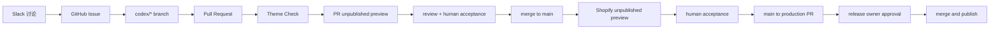

# Codex, GitHub, Slack and Shopify workflow

## Tool boundaries

| Tool | Responsibility |
| --- | --- |
| Slack | 讨论、需求入口、链接和快速反馈 |
| GitHub Issue | 持久的目标、范围、验收标准和 owner |
| Codex | 代码与文档实现、检查、预览准备和 PR |
| Claude Code / Orca | 协调、规格、脚本、测试与派工；派工规则见 `.agents/skills/dispatch/SKILL.md` |
| GitHub PR | 变更审查、验证证据和发布记录 |
| Shopify unpublished theme | 每个 PR 的代码预览、集成预览和人工验收 |
| Shopify published theme | 线上商店，只接收已批准发布 |

Slack 不保存唯一份决策或验收标准。任何要求 Codex 实现的内容，先转成 GitHub Issue，或在 Codex 任务中明确指向 Issue。

## Delivery flow

```mermaid
flowchart LR
    Slack[Slack 讨论] --> Issue[GitHub Issue]
    Issue --> Branch[codex/* branch]
    Branch --> PR[Pull Request]
    PR --> CI[Theme Check]
    CI --> PRPreview[PR unpublished preview]
    PRPreview --> Review[review + human acceptance]
    Review --> Main[merge to main]
    Main --> Preview[Shopify unpublished preview]
    Preview --> QA[human acceptance]
    QA --> Release[main to production PR]
    Release --> Approval[release owner approval]
    Approval --> Live[merge and publish]
```

## Branches

- `main`：日常集成分支，目标是连接未发布 Shopify Theme。
- `production`：线上发布分支；在正式上线前保持与已发布主题断开。
- `codex/<issue>-<slug>`：每个 Issue 一个短期分支。

如果 `production` 已连接发布主题，合并到该分支就是上线动作，因此人工批准必须发生在合并之前。

## Issue readiness

一个 Issue 只有在以下内容齐备时才进入实现：

- 用户或商业目标。
- 明确的包含范围和排除范围。
- 可观察的验收标准。
- 影响的页面、语言和设备。
- 是否涉及生产数据、真实交易或新权限。

## 交接与保留

资料保留以 `AGENTS.md` 为准。新会话从当前 Issue、目标文件和相关权威文档恢复，不阅读过程目录来重建讨论。决定修改到对应产品 / 领域 / 架构 / 设计文档；Issue 仅维护范围、状态与待解决问题，不建立并行 tracker。

PR 简记对应 Issue、最终行为、实际检查及结果、适用设备 / 语言、独立评审结论（如有）、未解决项和回滚方式。纯文档变更标明不适用的 UI 检查，无需生成截图或过程报告。

不把聊天、逐轮 QA、候选稿、检测输出与执行日志转存到仓库或 Issue / PR 附件。获批方向链接到 surface brief；必要的批准视觉与素材来源按 `AGENTS.md` 保留。提交前检查暂存 diff，不用 `git add -f` 绕过过程文件忽略规则。现存历史资料仅在追溯特定决定 / 来源时读取，迁出唯一有效结论后再清理。

## Slack activation gate

只在以下流程已经从头到尾成功跑通一次后，再把 Slack `@Codex` 作为日常入口：

1. GitHub Repo 、Issue 模板和 PR 模板可用。
2. Codex 能从 Issue 创建分支并提交 PR。
3. CI 可运行 Theme Check。
4. 每个同仓库 PR 可自动创建或更新独立的未发布 Shopify Theme，并在 PR 中显示预览链接。
5. 人工能根据验收标准通过或拒绝发布。

## PR preview safety

- PR 预览只处理同仓库分支；来自 fork 的 PR 不接收 Theme Access Secret，也不会自动部署。
- 每个 PR 使用固定名称 `PR-<number>` 的未发布主题，后续提交原地更新，避免耗尽 Shopify 主题数量上限。
- PR 关闭后自动删除对应的未发布主题。
- 自动化不使用 `--live`、`--publish` 或 `--allow-live`，不得修改线上主题。
- 仓库改名或转移后，重跑（rerun）之前的运行会被跳过：旧事件里的仓库名与当前不一致。要验证预览，推一次新提交或开一个空提交测试 PR。

## 仓库与外部连接

仓库在 GitHub 组织 `hitoami` 下：`hitoami/yarn-commerce-platform`（2026-09-26 从个人账号转入组织 `mewool-yarn`，同日组织改名为 `hitoami`，[Issue #80](https://github.com/hitoami/yarn-commerce-platform/issues/80)）。旧地址会跳转，但旧组织名一旦被他人注册，跳转就失效；新写的链接一律用新地址。

- 团队地图页：`https://hitoami.github.io/yarn-commerce-platform/`。GitHub Pages 地址跟随仓库所有者，改名 / 转移时不跳转，必须重新发给同事。
- GitHub App 按所有者安装：Codex、Claude 等要访问仓库，需装在组织 `hitoami` 上，个人账号上的安装不覆盖组织仓库。
- Shopify 主题 `yarn-commerce-platform/main` 是用 CLI 推送的普通主题，没有连接 GitHub；仓库迁移不影响它。
- 查主题列表用 `npx shopify theme list --store tutaka-54.myshopify.com --json`；`npm run admin` 的应用没有 `read_themes` 权限。
- 再次改名或转移仓库前，按以上各项逐一检查，并用一个测试 PR 验证预览。

## 浏览器操作

- Chrome 窗口在后台时，Shopify 后台不渲染，坐标点击和键盘输入也可能无效。先请用户把窗口切到前台；填表单时可直接按元素写值。
- 付款、接受条款、人机验证由用户本人完成；代理填到这一步就停下。
